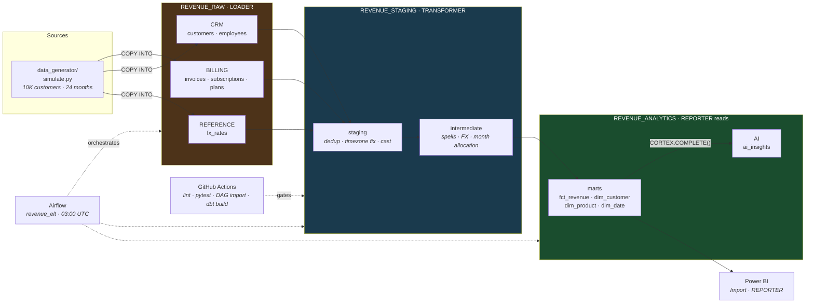

# SaaS Revenue Metrics Platform

**Snowflake · dbt · Airflow · SQL · Python · Power BI · GitHub Actions · Snowflake Cortex**

A SaaS CFO gets three different ARR numbers from three teams. This is the single pipeline everyone trusts — 511,089 invoice lines, deliberately dirty, transformed into one governed star schema with 163 tests standing between the data and the dashboard.



> **The meaningful observation:** a single duplicated row in a 123-row employee table
> inflates one account executive's revenue by **exactly 2.0×** — while moving the company
> total by only **+0.58%**. The dashboard doesn't look broken. It looks like FX. A report
> that shows 2× revenue gets fixed on Monday because it's absurd on sight; this one gets
> found by the AE checking their commission, weeks later, after the number is in a board
> pack. The thing standing between that bug and the board pack is a one-line `unique`
> test on a dimension nobody thinks is interesting.
> — [`powerbi/fanout_diagnosis.md`](powerbi/fanout_diagnosis.md), reproduced by [`fanout_repro.py`](powerbi/fanout_repro.py)

---

## What is measured, and what is not

This repo has **no Snowflake account attached**. That divides everything below into two
categories, and they're never mixed:

| | |
|---|---|
| ✅ **Measured** | The simulator, its manifest, the fan-out reproduction, sqlfluff, pytest, the Airflow DAG import — all run locally and in CI on every PR. |
| ⬜ **Not executed** | Anything needing a warehouse: the RBAC grants, `COPY INTO`, `dbt build`, the Cortex call, the query-profiling case study. |

Nothing in the second category is presented as a result. The query-profiling case study
has **every runtime cell deliberately blank** — the PRD asked for "45s → 3s with EXPLAIN
screenshots", and a fabricated before/after is the single most checkable lie a repo like
this could contain. It ships as a runnable experiment with a hypothesis written up front
that predicts a *null* result.

## Results

### Measured locally

| Metric | Value | Evidence |
|---|---:|---|
| Invoice lines generated | **511,089** | `data/raw/_manifest.json` |
| Invoice headers | 114,985 | ” |
| Subscription spells | 47,552 | ” |
| Customers | 10,000 | ” |
| Generation time | ~6s | `python data_generator/simulate.py` |
| Duplicate lines injected (replay) | **10,011** | manifest |
| Timezone-shifted rows | 40,965 | manifest |
| …of which **cross a month close** | **434** | manifest — the only ones that move money between periods |
| Late-arriving lines (>3d) | 7,569 | manifest |
| Orphan lines (dangling FK) | 500 | manifest |
| Fan-out inflation, company-wide | **+0.58%** | `powerbi/fanout_repro.py` |
| Fan-out inflation, affected AE | **exactly 2.0×** | ” |
| dbt tests | **163** | counted: 37 `not_null`, 19 `accepted_range`, 13 `relationships`, 13 `accepted_values`, 5 grain, 9 custom singular |
| Simulator tests | 20, ~2.1s | `pytest tests/` — green in CI |
| SQL lint | 0 parse errors, 0 violations | `sqlfluff` over 4 directories — green in CI |
| Airflow DAG | **imports cleanly, 11 tasks** | CI `DagBag` job |

### Requires a Snowflake account

| Claim | Status |
|---|---|
| Query runtime before/after clustering | ⬜ **Not measured** — [method + hypothesis here](sql_showcase/query_profiling_case_study.md) |
| Cortex cost / latency per summary | ⬜ **Not measured** — [query to find out](cortex_ai/README.md#cost) |
| `dbt build` against real data | ⬜ CI job exists and **skips** when no credentials are configured |
| RBAC grants behave as documented | ⬜ Verification queries at the foot of each `snowflake_setup/` file |

## Quick start

```bash
pip install -r requirements.txt

python data_generator/simulate.py    # ~6s -> data/raw/, 511,089 invoice lines
pytest tests/ -v                     # 20 tests
python powerbi/fanout_repro.py       # reproduces the 2.0x fan-out
sqlfluff lint dbt_project/models dbt_project/tests snowflake_setup sql_showcase cortex_ai
```

That runs with no cloud account and no credentials. To go further:

<details>
<summary><b>Against a Snowflake trial</b></summary>

```bash
# 1. Set up the account (run in numeric order — 01 needs ACCOUNTADMIN)
#    snowflake_setup/01_rbac_roles.sql   -> roles, warehouses, resource monitor
#    snowflake_setup/02_schema_design.sql -> databases, schemas, raw DDL, grants

# 2. Stage + load
snowsql -a $SNOWFLAKE_ACCOUNT -u $SNOWFLAKE_USER -r LOADER -w WH_LOADING \
  -q "PUT file://$(pwd)/data/raw/*.csv @REVENUE_RAW.BILLING.STG_LANDING AUTO_COMPRESS=TRUE OVERWRITE=TRUE;"
snowsql ... -f snowflake_setup/03_copy_into.sql

# 3. Transform
cd dbt_project
cp profiles.yml.example ~/.dbt/profiles.yml   # every value reads from env vars
dbt deps && dbt build && dbt docs generate
```
Set the first credit ceiling **before** anything else — `01_rbac_roles.sql` creates a
50-credit resource monitor as its last step and attaches it to all three warehouses.
</details>

<details>
<summary><b>Airflow locally</b></summary>

```bash
cd airflow
echo "AIRFLOW_UID=$(id -u)" > .env    # Linux/macOS
docker compose up -d                  # http://localhost:8080 — airflow/airflow
```
Everything past `extract` needs Snowflake credentials. Without them the DAG fails at the
load task, which is the correct and obvious behaviour.
</details>

## The decisions worth reading

Every layer here has one choice that carries it. These are the five that would come up in review.

**Billing is on the anniversary, not the calendar month.**
A period runs 14 Mar → 13 Apr: one invoice, two calendar months (an annual contract spans
thirteen). So `date_trunc('month', issued_at)` would dump the whole charge into March,
hole out April, and do it *consistently enough to look like seasonality rather than a
bug*. [`int_revenue_allocated_to_months`](dbt_project/models/intermediate/int_revenue_allocated_to_months.sql)
allocates pro-rata by days, and
[`assert_allocation_conserves_revenue`](dbt_project/tests/assert_allocation_conserves_revenue.sql)
pins both halves: slices sum back to the amount **and** fractions sum to exactly 1.0. The
second is the stronger one — a period partly outside the month spine allocates 95% of
itself and stays internally consistent if only the amount is checked.

**Churn is an absence, so the grain is a spine.**
No source table has a "churned" row to count. Churn is the *absence* of MRR in a month
that followed MRR — and you cannot detect an absence in a dataset containing only
presences. [`int_customer_months`](dbt_project/models/intermediate/int_customer_months.sql)
enumerates every customer-month and lets MRR be zero. Aggregate instead of enumerate, and a
churned customer has no April row, April's churn is zero forever, and every test passes.

**`REPORTER` has no grant on staging, and that restriction is the product.**
If analysts can reach `int_customer_months`, someone eventually builds a dashboard on an
intermediate model and the CFO has three ARR numbers again — the exact problem this exists
to end. One place to compute ARR means one ARR. See
[`01_rbac_roles.sql`](snowflake_setup/01_rbac_roles.sql); the negative grants carry the
reasoning (`LOADER` has no `RAW_READ`, `TRANSFORMER` has no `RAW_WRITE` — so the
raw-vs-staging reconciliation test isn't checking dbt against itself).

**The ARR tolerance test is run-over-run, not month-over-month.**
The PRD asked for day-over-day. Both obvious readings are broken: adjacent months fail on
legitimate ramp growth, and a hardcoded baseline rots and gets edited to make CI green.
What matters is *a closed month's ARR changing between two runs* — March 2025 is a fact,
and if today's run disagrees with yesterday's about it, a code change moved a closed
month. That's invisible to any single-run test. Backed by
[`fct_arr_snapshot`](dbt_project/models/marts/fct_arr_snapshot.sql).
Honest gap: vacuous on the first run and after a `--full-refresh` of the snapshot, which
is why that's flagged as a deliberate act in the [runbook](runbooks/dag_failure_recovery.md).

**`issued_at` lands as `TIMESTAMP_NTZ`.**
The source contract says UTC; `billing_sync_v2` writes IST. Typing it `TZ` means either
believing the contract (baking a 5h30m error into raw permanently, indistinguishable from
a real timestamp) or guessing per row. `NTZ` stores the wall-clock as sent and defers the
fix to `stg_invoices`, where it's a visible, testable, revertable line of SQL rather than
an assumption frozen into DDL.

## The tests that do real work

163 total. The nine custom ones are where the thinking is:

| Test | Catches |
|---|---|
| [`assert_mrr_waterfall_reconciles`](dbt_project/tests/assert_mrr_waterfall_reconciles.sql) | **A double-count.** A fan-out leaves every column looking reasonable — MRR positive, categories valid, nothing null — and only the total wrong. No single-column test finds it; only the identity does. |
| [`assert_allocation_conserves_revenue`](dbt_project/tests/assert_allocation_conserves_revenue.sql) | Proration leaking or inventing revenue — errors small enough to look like rounding, systematic enough to be a misstatement |
| [`assert_raw_staging_row_reconciliation`](dbt_project/tests/assert_raw_staging_row_reconciliation.sql) | Asserts `raw − duplicates_removed = staging`, not `raw = staging` (which would fail every run, get set to `warn`, and never be read again) |
| [`assert_timezone_correction_applied`](dbt_project/tests/assert_timezone_correction_applied.sql) | The fix hitting the *wrong* rows — which would move 460K good rows by 5h30m and look, on any summary query, like it had worked |
| [`assert_usd_conversion_is_correct`](dbt_project/tests/assert_usd_conversion_is_correct.sql) | Includes a USD-identity control: if the divide were a multiply, USD passes and every US spot-check looks clean while JPY is off by 151× |
| [`assert_org_hierarchy_is_traversable`](dbt_project/tests/assert_org_hierarchy_is_traversable.sql) | Two roots (reports a subtree as the whole company, plausibly) or a cycle (hangs the recursive CTE at 03:00) |

Plus grain, credit-line signs, and the ARR tolerance above.

**The most arguable line in the project** is the `relationships` severity on
`stg_invoices.subscription_id`. The 500 orphans are late-arriving parents, not corruption
— the invoice is real, its subscription just hasn't landed. Erroring means a source-side
timing quirk stops ARR publishing; dropping them silently understates revenue with no
trace. So: `warn`, with `error_if: ">550"`. Above that it stops being lateness and becomes
a broken extract.

## Repository map

| Path | What's there |
|---|---|
| [`data_generator/`](data_generator/simulate.py) | Seeded simulator. 7 defect classes, counted in `_manifest.json` |
| [`snowflake_setup/`](snowflake_setup/) | RBAC (two-tier), 3 databases, raw DDL, `COPY INTO`. Every grant carries its reason |
| [`dbt_project/`](dbt_project/) | 16 models across 3 layers, 163 tests, `drop_ci_schema` macro with 3 guards |
| [`sql_showcase/`](sql_showcase/) | Window-function waterfall, recursive CTE rollup, `GROUPING SETS` cohorts, [profiling method](sql_showcase/query_profiling_case_study.md) |
| [`airflow/`](airflow/) | Dockerized LocalExecutor + `revenue_elt` DAG (11 tasks, imports clean in CI) |
| [`cortex_ai/`](cortex_ai/) | `CORTEX.COMPLETE()` summaries as governed rows + [Cortex vs external API](cortex_ai/README.md) |
| [`powerbi/`](powerbi/fanout_diagnosis.md) | The fan-out diagnosis — **reproduced, not recalled** |
| [`runbooks/`](runbooks/dag_failure_recovery.md) | DAG failure recovery, incl. a *do-not-do-these* section |
| [`.github/workflows/ci.yml`](.github/workflows/ci.yml) | 4 jobs, split by what they need so fork PRs still get real checks |

## Data quality: 7 injected defects, all counted

The data is dirty on purpose. Every defect is injected deliberately and counted **on the
emitted file** — so when a test says it caught something, the claim is a number anyone can
reproduce by opening the CSV.

| Defect | Count | Why it's nasty |
|---|---:|---|
| Duplicate lines | 10,011 | `SELECT DISTINCT` will **not** remove them — `ingested_at` differs. Dedup must key on `(invoice_id, line_number)` and keep the latest |
| Timezone shift | 40,965 → **434** | Only the 434 that cross a month close move money between periods. That's the number worth quoting, not the 40,965 |
| Late arrivals | 7,569 | Land 3–30d after their event, i.e. after the month closed. An incremental model keyed on the current month loses them silently |
| Orphans | 500 | Dangling `subscription_id` — caught by `relationships` |
| Null `payment_method` | 25,822 | Injected at header grain, fans out to lines |
| Null `employee_count` | 1,277 | Left NULL deliberately — defaulting a *measure* to 0 drags every average toward zero |
| Null `industry` | 661 | Coalesced to `'Unknown'` — a `GROUP BY` silently drops NULLs and segment totals stop reconciling |

> **This was a bug before it was a feature.** The manifest originally counted defects at
> injection time, at *header* grain, while the file is at *line* grain — under-reporting
> the timezone bug by 4.5× (claimed 378 affected rows; the file had 1,708).
> `tests/test_simulate.py` caught it by counting the emitted CSV instead of trusting the
> generator's own bookkeeping. That's the only reason the numbers in this README are worth
> anything, and CI now fails if the committed manifest drifts from a fresh run.

## CI

Four jobs, split by **what they need** rather than what they check — so `lint`, `tests`
and `dag-import` run on every PR including forks, while `dbt-build` (which needs
credentials forks can't have) is isolated and **skips rather than fails** when no secrets
are configured. A CI badge that's always red is a badge nobody reads.

The `dag-import` job asserts more than importability:

```python
assert str(gate.trigger_rule) == 'all_success'
assert any('dbt_test' in t for t in upstream)
```

`publish_gate`'s trigger rule is the only thing between a failed test and a published
mart, and it's one word away from being useless. A code review shouldn't be what catches
that.

The lint has already earned its keep: it caught `CREATE RESOURCE MONITOR ... IF NOT
EXISTS` in M2 — which Snowflake rejects — before it ever reached an account.

## Milestones

Each was one PR. `git log --oneline` and the [merged PRs](../../pulls?q=is%3Apr+is%3Amerged) are the build history.

| # | Milestone | PR |
|---|---|---|
| M1 | Data simulator + 20 tests | [#1](../../pull/1) |
| M2 | Snowflake RBAC, schemas, `COPY INTO` | [#2](../../pull/2) |
| M3 | dbt project — 16 models, 163 tests | [#3](../../pull/3) |
| M4 | Expert SQL showcase + profiling method | [#4](../../pull/4) |
| M5 | Airflow orchestration + runbook | [#5](../../pull/5) |
| M6 | CI/CD + PR template | [#6](../../pull/6) |
| M7 | Snowflake Cortex summaries | [#7](../../pull/7) |
| M8 | Power BI fan-out diagnosis + this README | [#8](../../pull/8) |

## Honest limitations

- **`dim_customer` is Type 1.** Slice historical ARR by region and you get *today's*
  region applied to every past month, so a territory reshuffle silently rewrites last
  year. Type 2 would fix it; the generator emits no change history to build it from, and
  inventing a `valid_from` would be modelling a fact that doesn't exist. Revenue-by-plan
  *is* correct over time (`fct_revenue` carries `plan_key` at the month it applied);
  revenue-by-region is not.
- **MRR is measured at month end**, so a customer who churned on the 2nd and one who
  churned on the 30th look identical. Time-weighting would measure activity rather than
  commitment and produce a number nobody can reconcile to a contract. Recognized revenue
  *is* time-weighted — the two answer different questions and the mart carries both.
- **The data is synthetic.** Every "defect" is one I injected, so the tests catch bugs
  whose shape I already knew. That's a real limit on what the test suite proves.
- **sqlfluff checks syntax, not semantics.** `dbt build` is what proves the logic, and it
  needs a warehouse.
